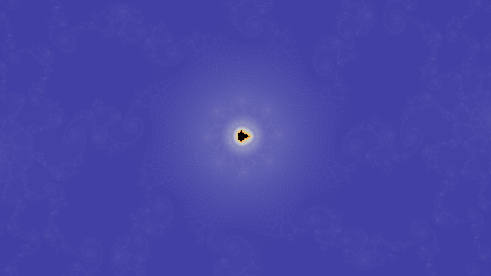
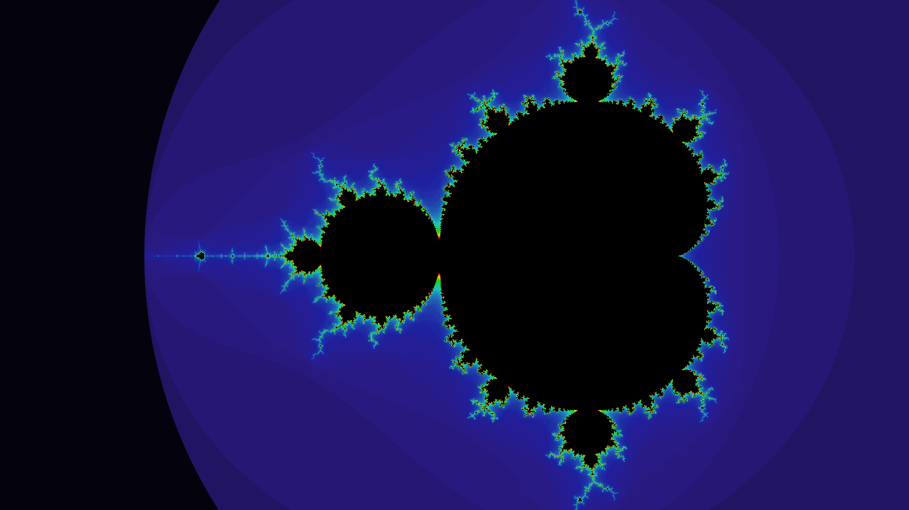
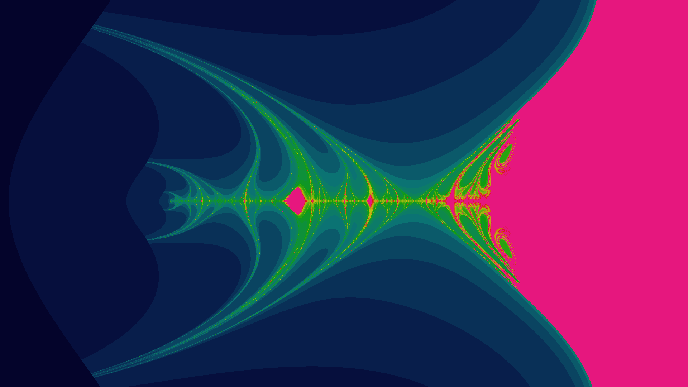

# fractal-explorers

Interactive fractal exploration utilities built using Julia and (GL)Makie
supporting rendering on CPU and GPU (currently only via CUDA.jl).

## Current achievements

Typical stuff:

Things created by accident:

